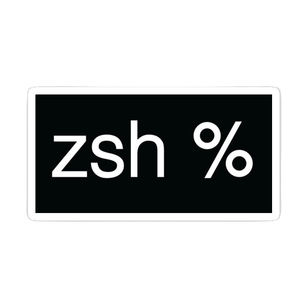
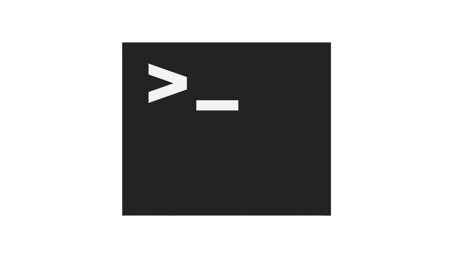

# Minishell 
## Developed with [toke5](https://github.com/toke5) 

<div>
  
  
  
  
  
  
</div>

## Description

Minishell is an ambitious shell implementation written in C. This comprehensive project extends beyond basic command-line functionality, integrating advanced parsing, child process management, multiprocess signal handling, and sophisticated piping and redirection mechanisms. Compatible with both Mac and Linux environments, this shell emulates traditional Unix shells, offering a powerful, user-friendly interface for command execution and script processing.

## Key Features

- **Cross-Platform:** Fully compatible with both macOS and Linux operating systems.
- **Advanced Parsing:** Robust parsing mechanism to interpret complex command lines and arguments.
- **Child Process Execution:** Efficient management and execution of child processes.
- **Multiprocess Signal Handling:** Handles signals in a multiprocess environment, ensuring stability and responsiveness.
- **Piping and Redirections:** Implements sophisticated piping and redirection functionalities for versatile command line operations.
- **Built-in Commands:** Includes several built-in commands for enhanced shell functionality.
- **Logical Operators:** Supports '&&' and '||' operators for conditional command execution.
- **Heredoc Support:** Offers functionality for heredoc (here documents) for directing input into an interactive shell script.
- **Command Execution:** Execute standard Unix commands with ease.

## Getting Started

### Prerequisites

- GCC Compiler or equivalent C compiler
- Unix-based operating system (Linux, macOS, etc.)

### Installation
   ```bash
   git clone [URL]
   cd minishell && make && ./minishell
   ```